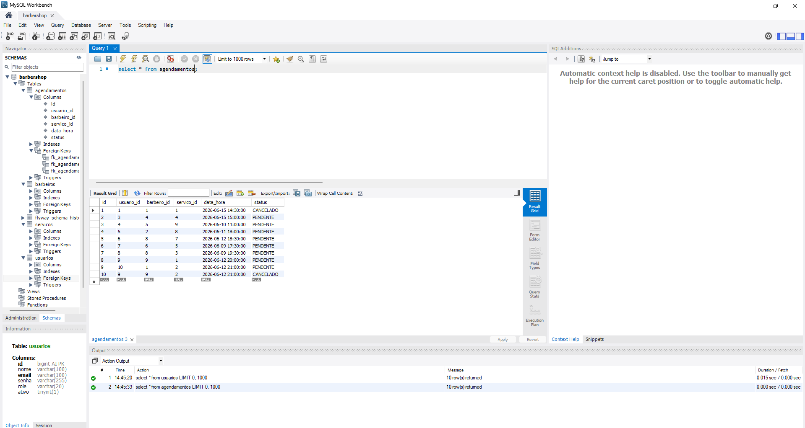
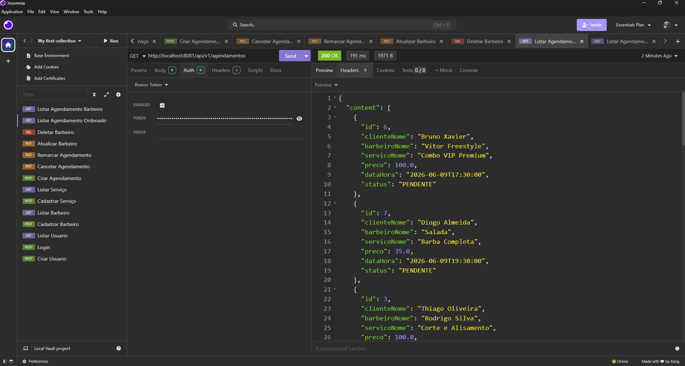

# 💈 BarberShop API

API REST robusta desenvolvida para o gerenciamento e agendamento de serviços em barbearias. O sistema conta com autenticação segura, controle de permissões por perfil e validações rigorosas de regras de negócio.

---

## 🚀 Tecnologias Utilizadas

O projeto foi construído utilizando as melhores práticas do ecossistema Java moderno e mercado corporativo:

* **Java 17** (Utilizando Records para DTOs imutáveis)
* **Spring Boot 3**
* **Spring Security** (Controle de acesso stateless)
* **JSON Web Token (JWT)** (io.jsonwebtoken para autenticação)
* **Spring Data JPA & Hibernate**
* **MySQL** (Banco de dados relacional)
* **Flyway** (Migração e versionamento profissional do banco de dados)
* **Lombok** (Produtividade e código limpo)
* **Jakarta Bean Validation** (Validação de entrada de dados)


---

## 🔒 Arquitetura & Diferenciais Técnicos

* **Segurança Stateless:** Autenticação baseada em tokens JWT. Os endpoints são protegidos de acordo com o perfil do usuário (`ROLE_ADMIN` ou `ROLE_CLIENTE`).
* **Versionamento de Banco com Flyway:** O Hibernate (`ddl-auto=none`) não altera tabelas automaticamente. Toda a evolução do banco de dados MySQL é controlada estritamente por scripts SQL organizados por migrações.
* **Tratamento Global de Erros:** Utilização de `@RestControllerAdvice` para interceptar exceções (como e-mails duplicados, dados inválidos ou erros de sintaxe no JSON) e retornar respostas padronizadas com mensagens amigáveis para o cliente da API.
* **Consistência de Negócio:** Uso de *Derived Queries* customizadas no Spring Data para impedir choques de horário na agenda (ex: dois agendamentos no mesmo horário com o mesmo barbeiro).
* **Soft Delete:** Remoção lógica para barbeiros e serviços (`ativo = false`), preservando o histórico de agendamentos passados no banco de dados.



---

## 🗺️ Endpoints Principais da API

### Autenticação e Usuários
* `POST /auth/register` - Cadastro de novos clientes.
* `POST /auth/login` - Autenticação de usuários com retorno do Token JWT.

### Agendamentos
* `POST /agendamentos` - Criação de um novo agendamento (Valida data futura e choque de horários).
* `GET /agendamentos` - Listagem de agendamentos ordenada por data e hora.

### Catálogo e Profissionais
* `GET /barbeiros` - Lista apenas os barbeiros ativos no sistema.
* `GET /servicos` - Lista o catálogo de serviços ativos e preços.



---

## ⚙️ Como Executar o Projeto Localmente

### Pré-requisitos
* Java 17 instalado.
* MySQL Server rodando localmente.

### Passos para Execução

1. **Clone o repositório:**
   ```bash
   git clone [https://github.com/AmonCarlos001/barbershop-api.git](https://github.com/AmonCarlos001/barbershop-api.git)
   
   2. **Configure o Banco de Dados:**
   * Abra o seu MySQL (via Workbench ou terminal) e crie o banco de dados principal com o comando:
     ```sql
     CREATE DATABASE barbershop;
     ```

3. **Configuração de Credenciais:**
   * Ajuste o arquivo `src/main/resources/application.properties` informando o seu usuário e a sua senha do MySQL local nas propriedades `DATABASE_USERNAME` e `DATABASE_PASSWORD`.

4. **Execute a Aplicação:**
   * Execute o projeto através da sua IDE de preferência ou utilizando o Maven Wrapper pelo terminal. O Flyway irá rodar as migrações estruturais automaticamente assim que o sistema subir.
   * A API estará disponível e pronta para receber requisições em `http://localhost:8081`.
  
   * ---

## 📬 Contato

Se tiver alguma dúvida, sugestão ou quiser bater um papo sobre desenvolvimento back-end, sinta-se à vontade para se conectar comigo!

[](https://www.linkedin.com/in/amon-carlos-dev)
