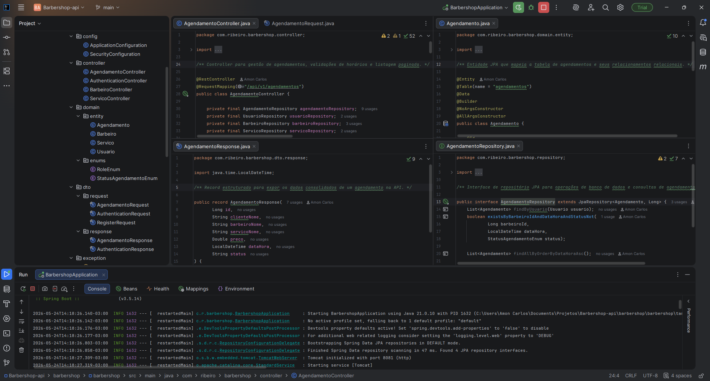

# 💈 BarberShop API

API REST robusta desenvolvida para o gerenciamento e agendamento de serviços em barbearias. O sistema conta com autenticação segura, controle de permissões por perfil e validações rigorosas de regras de negócio.

---

## 🚀 Tecnologias Utilizadas

O projeto foi construído utilizando as melhores práticas do ecossistema Java moderno e mercado corporativo:

| Tecnologia | Descrição |
|---|---|
| **Java 17** | Records para DTOs imutáveis |
| **Spring Boot 3** | Framework principal |
| **Spring Security** | Controle de acesso stateless |
| **JWT** | Autenticação via io.jsonwebtoken |
| **Spring Data JPA & Hibernate** | Persistência de dados |
| **MySQL** | Banco de dados relacional |
| **Flyway** | Migração e versionamento do banco |
| **Lombok** | Produtividade e código limpo |
| **Jakarta Bean Validation** | Validação de entrada de dados |



---

## 🔒 Arquitetura & Diferenciais Técnicos

- **Segurança Stateless:** Autenticação baseada em tokens JWT. Os endpoints são protegidos de acordo com o perfil do usuário (`ROLE_ADMIN` ou `ROLE_CLIENTE`).
- **Versionamento de Banco com Flyway:** O Hibernate (`ddl-auto=none`) não altera tabelas automaticamente. Toda a evolução do banco é controlada por scripts SQL organizados por migrações.
- **Tratamento Global de Erros:** Uso de `@RestControllerAdvice` para interceptar exceções e retornar respostas padronizadas com mensagens amigáveis.
- **Consistência de Negócio:** Derived Queries customizadas no Spring Data para impedir choques de horário na agenda.
- **Soft Delete:** Remoção lógica para barbeiros e serviços (`ativo = false`), preservando o histórico de agendamentos.


---

## 🗺️ Endpoints Principais da API

### 🔑 Autenticação e Usuários
| Método | Endpoint | Descrição |
|---|---|---|
| `POST` | `/auth/register` | Cadastro de novos clientes |
| `POST` | `/auth/login` | Autenticação com retorno do Token JWT |

### 📅 Agendamentos
| Método | Endpoint | Descrição |
|---|---|---|
| `POST` | `/agendamentos` | Criação de agendamento (valida data futura e choques) |
| `GET` | `/agendamentos` | Listagem ordenada por data e hora |

### ✂️ Catálogo e Profissionais
| Método | Endpoint | Descrição |
|---|---|---|
| `GET` | `/barbeiros` | Lista barbeiros ativos no sistema |
| `GET` | `/servicos` | Lista catálogo de serviços ativos e preços |


---

## ⚙️ Como Executar o Projeto Localmente

### Pré-requisitos
- Java 17 instalado
- MySQL Server rodando localmente

### Passos para Execução

**1. Clone o repositório:**
```bash
git clone https://github.com/AmonCarlos001/barbershop-api.git
```

**2. Crie o banco de dados:**
```sql
CREATE DATABASE barbershop;
```

**3. Configure as credenciais:**

Abra o arquivo `src/main/resources/application.properties` e defina:
```properties
DATABASE_USERNAME=seu_usuario
DATABASE_PASSWORD=sua_senha
```

**4. Execute a aplicação:**

Via IDE ou pelo terminal com o Maven Wrapper:
```bash
./mvnw spring-boot:run
```

A API estará disponível em `http://localhost:8081`. O Flyway rodará as migrações automaticamente ao subir.

---

## 📬 Contato

Se tiver alguma dúvida, sugestão ou quiser bater um papo sobre desenvolvimento back-end, fique à vontade para se conectar!

[](https://www.linkedin.com/in/amon-carlos-dev)
